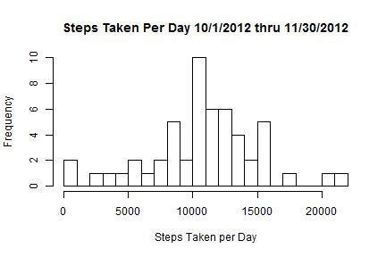
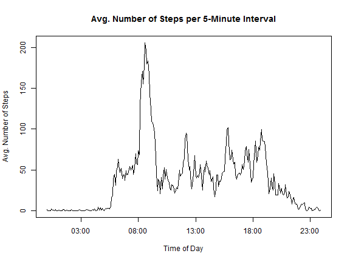
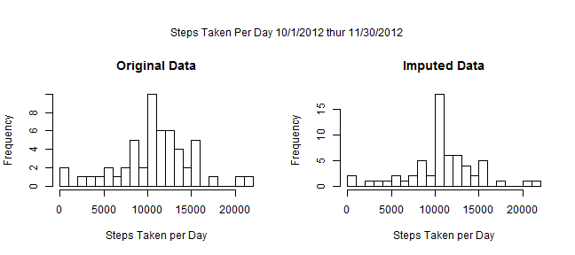
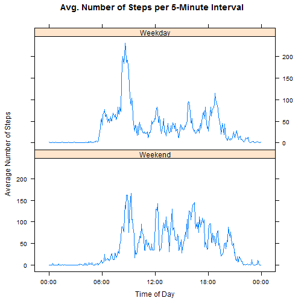

Reproducible Research - Peer Assessment #1
========================================================
This document completed the steps of the assignment for the first peer 
assement for the Reproducible Research class.  The instructions for the 
assignment can be found in the [README.md][1] file in the 
[RepData_PeerAssessment1][2] repo on the GitHub account of [rdpeng][3].    

## Required Packages  
The following packages are required for the analysis.  

```r
library(lattice)
library(plyr)
```

## Session Information  
Here is the R session information used for this analysis.

```r
sessionInfo()
```

```
## R version 3.1.0 (2014-04-10)
## Platform: x86_64-w64-mingw32/x64 (64-bit)
## 
## locale:
## [1] LC_COLLATE=English_United States.1252 
## [2] LC_CTYPE=English_United States.1252   
## [3] LC_MONETARY=English_United States.1252
## [4] LC_NUMERIC=C                          
## [5] LC_TIME=English_United States.1252    
## 
## attached base packages:
## [1] stats     graphics  grDevices utils     datasets  methods   base     
## 
## other attached packages:
## [1] plyr_1.8.1      lattice_0.20-29 knitr_1.6      
## 
## loaded via a namespace (and not attached):
## [1] evaluate_0.5.5 formatR_0.10   grid_3.1.0     Rcpp_0.11.1   
## [5] stringr_0.6.2  tools_3.1.0
```

## Activity 1: Loading and Preprocessing the Data  

If you need to download the file, run this code.  This code will not be
evaluated as a part of this document.  

```r
# create temporary variable
temp <- tempfile()
# assign url
url <- "http://d396qusza40orc.cloudfront.net/repdata%2Fdata%2Factivity.zip"
# download file
download.file(url, temp)
# unzip to current directory
unzip(temp)
# unlink  
unlink(temp)
```

#### Load the Data  


```r
# read data
zip.file <- "activity.zip"
unzip(zip.file) # unzip to current directory
filename <- "activity.csv"
activity <- read.csv(filename, header = TRUE)
```

#### Process/transform the data  
The variable [interval] is actually the time of day. Transform [interval] to a new character 
string of length 4.  Interval needs to be maintained for summary reporting.  

```r
activity$timeAsChar <- (sprintf("%04d", activity$interval))
```

Concatenate [date] and [timeAsChar] to create a newdate.

```r
activity$dateTime <- as.POSIXlt(strptime(paste(activity$date,
                      format(activity$timeAsChar,
                      format = "%H%M")),
                      "%Y-%m-%d %H%M"))
```

## Activity 2: What is the mean total number of steps taken per day?  

For this first question, missing values can be ignored.  

The first step is to sum the number of steps taken each day, 
which can be accomplished with **ddply** from the *plyr* 
package.     

```r
summaryByDay <- plyr::ddply(activity, .(date), summarize,
                      stepsTotal = round(sum(steps, na.rm = FALSE),2))
```

This code produces a **histogram of the total number of steps taken each day**.  

```r
hist(summaryByDay$stepsTotal, xlab = "Steps Taken per Day",
     breaks = 30,
     main = "Steps Taken Per Day 10/1/2012 thru 11/30/2012")
```

 

This code alculates the **mean** and **median** total number of steps taken per day, and is reported following the code.    

```r
options(scipen = 20) #set scientific notation value
mean.per.day <- round(mean(summaryByDay$stepsTotal, na.rm = TRUE),1)
median.per.day <- round(median(summaryByDay$stepsTotal, na.rm = TRUE),1)
```
For days with step values...  
The avg. number of steps per day is 10766.2.  
The median steps per day is 10765.  

## Activity 3: What is the average daily activity pattern?  

The objective is to make a time series plot of average number of steps taken (averaged across all days) verus the 5-minute intervals.  To do this, the data must first be summarized by
interval.  

```r
summaryByInterval <- ddply(activity, .(interval), summarise,
                           stepsTotal = round(sum(steps, na.rm = TRUE),2),
                           stepsMean = round(mean(steps, na.rm = TRUE),2))
```
Next, the interval must be converted to time.  

```r
summaryByInterval$time <- strptime(sprintf("%04d", summaryByInterval$interval), 
    format = "%H%M")
```
Finally, the data can be plotted as a **time series**.

```r
plot(x = summaryByInterval$time, y = summaryByInterval$stepsMean,
     type = "l",
     xlab = "Time of Day",
     ylab = "Avg. Number of Steps",
     main = "Avg. Number of Steps per 5-Minute Interval")
```

 

This code determines **which 5-minute interval, on average, contains the maximum number of steps**.  The answer is reported after the code.  


```r
# determine which rownum in the dataframe has maximum mean Steps
max.steps.rownum <- which.max(summaryByInterval$stepsMean)
# return the interval of that max
max.steps.interval <- sprintf("%04s",as.character(summaryByInterval[max.steps.rownum,1]))
```
The **maximum average number of steps per 5-minute interval** occurs at  835.

## Activity 4: Imputing missing values  
Within the dataset, there are a number of day/interval pairs that are missing values (the number of steps).  Missing values for each interval will be replaced with the mean number of steps calculated for all valid entries, by interval.  

First, the number total number of observations with missing values is calculated and reported.  

```r
# caculate and report the total number of missing values in the dataset
missing.steps <- table(is.na(activity))[2]
rownum <- nrow(activity)
```
There are 2304 values of steps that are missing data.
This represents 0.1311 percent of the total file.  

Missing values of steps at each interval were replaced by the interval mean over
all dates. The code to impute the missing values was borrowed from [this post][4]
on stackoverflow.

```r
# technique to replace NA with mean by subset in R and the impute.mean function 
# described at http://stackoverflow.com/a/9322975/3657371
impute.mean <- function(x) replace(x, is.na(x), mean(x, na.rm = TRUE))

# create a new dataset that is equal to the original dataset, but with the 
# missing data filled in
# original dataset is first three variables of the [activity] dataframe
activity.imputed <- ddply(activity[1:3], .(interval), transform,
                          steps = impute.mean(steps),
                          date = date,
                          interval = interval)

# sort by date and interval
activity.imputed <- activity.imputed[order(activity.imputed$date,
                                           activity.imputed$interval),]

# renumber rownames
row.names(activity.imputed) <- 1:nrow(activity.imputed)
```

To make a histrogram of the total number of steps taken each day, using imputed data, the imputed dataset must first be summarize the number
of steps by date.  

```r
summaryByDay.imputed <- ddply(activity.imputed, .(date), summarize,
                              stepsTotal = round(sum(steps, na.rm = FALSE),2))
```

Here is a **historgam of the total number of steps taken each day** for both the **original** and **imputed** datasets.  While the imputed dataset has a greater 
frequency of occurances, the shape of the histograms are the same.  

```r
par(mfrow = c(1,2), oma = c(0,0,3,0))
hist(summaryByDay$stepsTotal, xlab = "Steps Taken per Day",
     breaks = 30,
     main = "Original Data")
hist(summaryByDay.imputed$stepsTotal, xlab = "Steps Taken per Day",
     breaks = 30,
     main = "Imputed Data")
mtext("Steps Taken Per Day 10/1/2012 thur 11/30/2012", outer = TRUE)
```

 

Calculating the **mean** and **median** total number of steps taken per day.


```r
mean.per.day.imputed <- round(mean(summaryByDay.imputed$stepsTotal, na.rm = TRUE),1)
median.per.day.imputed <- round(median(summaryByDay.imputed$stepsTotal, na.rm = TRUE),1)
```
| Dataset    | Mean Steps Per Day | Median Steps Per Day |
|:-----------|-------------------:|---------------------:|
|Imputed  | 10766.2 | 10766.2 |
|Original  | 10766.2 | 10765 |  

These are the same values as the original dataset when days with missing values
were ignored.  Since the missing values were imputed with means, these 
similarities are expected.

## Activity 5: Activity Patterns for Weekdays and Weekends  
This section compares the number of steps taken for weekdays and weekends.  For
the purposes of this study, weekends are defined as Saturday and Sunday.  

In order to determine the day of the week, the [date] variable needs to be 
transformed from a character class to a date class.  The same data transformations
that we applied to the original dataset must be applied to the imputed dataset..

```r
# Transform [interval] to a new character string of length 4. 
activity.imputed$timeAsChar <- (sprintf("%04d", activity.imputed$interval))
```


```r
# Concatenate [date] and [timeAsChar] to create a newdate.
activity.imputed$dateTime <- as.POSIXlt(strptime(paste(activity.imputed$date,
                              format(activity.imputed$timeAsChar,
                              format = "%H%M")),
                              "%Y-%m-%d %H%M"))
```

Next, each date is classified as a weekday or weekend.  First the day of the
week is calculated. Then a function is created to identify each day as a 
weekday or weekend, and this function is applied to all rows in the dataframe.


```r
activity.imputed$dayOfWeek <- weekdays(activity.imputed$dateTime)


f.dayType <- function(day) {
# classify day of week as weekend or weekday
  weekend.day <- c("Saturday", "Sunday")
  if ( day %in% weekend.day ) {
    "Weekend"
  } else
    "Weekday"
}

# iterate through the dataframe, applying f.dayType() on $dayOfWeek
activity.imputed$dayType <- sapply(activity.imputed$dayOfWeek, f.dayType)
```

Next, a dataframe of summary of the imputed dataset is created.  

```r
summaryByDayTypeAndInterval <- ddply(activity.imputed, .(interval, dayType), 
                           summarise,
                           stepsTotal = round(sum(steps, na.rm = TRUE),2),
                           stepsMean = round(mean(steps, na.rm = TRUE),2))
```

The interval variable must be converted to time, and then to a POSIXct class.  

```r
summaryByDayTypeAndInterval$time <- strptime(sprintf("%04d",
                                      summaryByDayTypeAndInterval$interval), 
                                      format = "%H%M")
#convert to POSIXct
summaryByDayTypeAndInterval$time <- 
  as.POSIXct(summaryByDayTypeAndInterval$time)
```

The panel plot comparing average number of steps per 5-minute interval on
weekends and weekdays is created using the lattice package.  

```r
# make the plot using the lattic package
lattice::xyplot(stepsMean ~ time | dayType, data = summaryByDayTypeAndInterval, 
       type = "l", # line chart
       layout = c(1,2), # 1 column, 2 rows
       ylab = "Average Number of Steps", # y-axis title
       xlab = "Time of Day", # x-axis title
       index.cond = list(c(2,1)), # force the Weekday panel on top
       main = "Avg. Number of Steps per 5-Minute Interval",
       scales = list( x = list(format = "%H:%M")) # format the x-axis labels
       )
```

 

[1]: https://github.com/rdpeng/RepData_PeerAssessment1/blob/master/README.md "README.md"
[2]: https://github.com/rdpeng/RepData_PeerAssessment1 "RepData_PeerAssessment1"
[3]: https://github.com/rdpeng "rdpeng"
[4]: http://stackoverflow.com/a/9322975/3657371 "this post"
